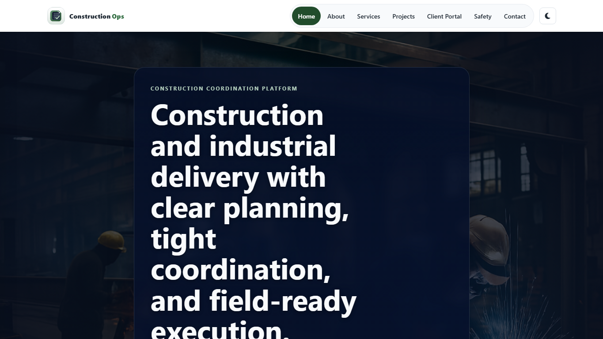
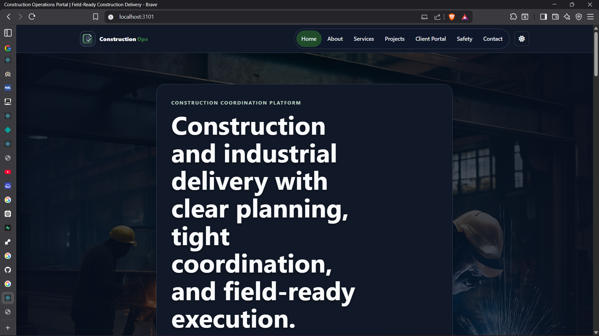
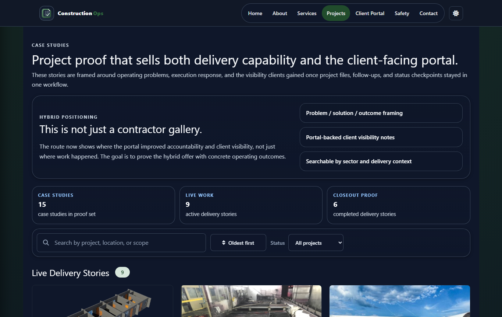
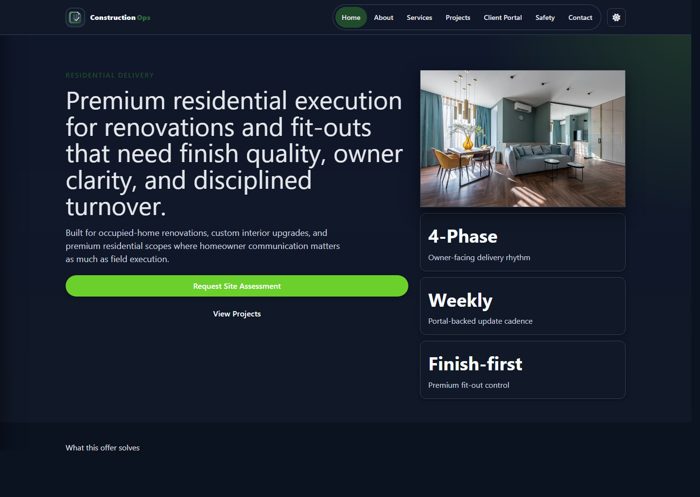
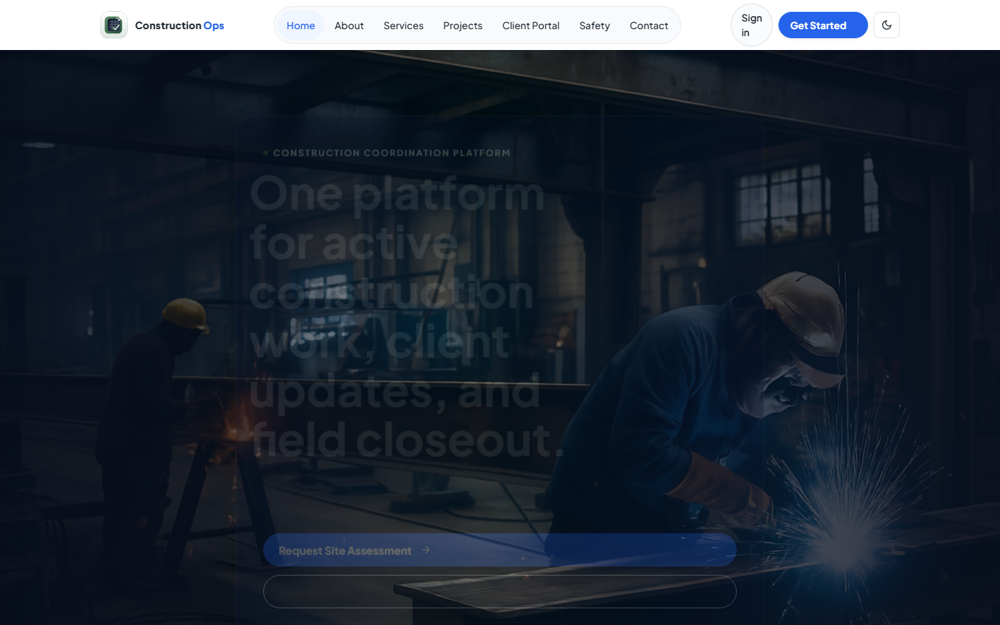
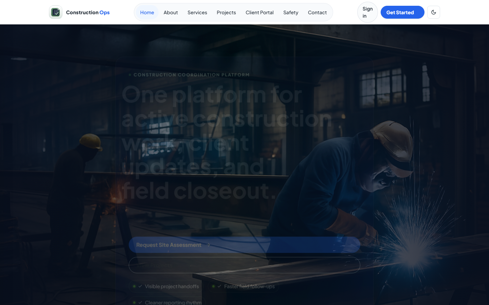
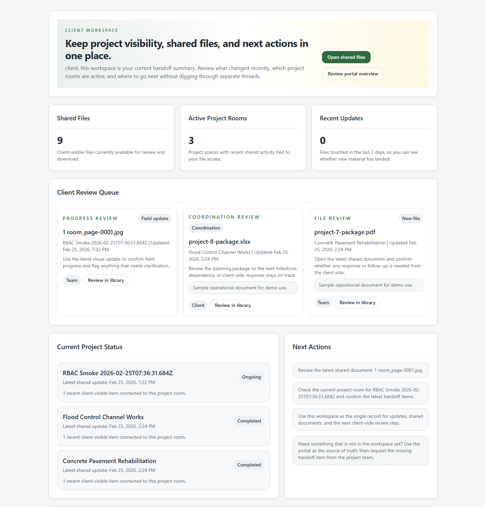
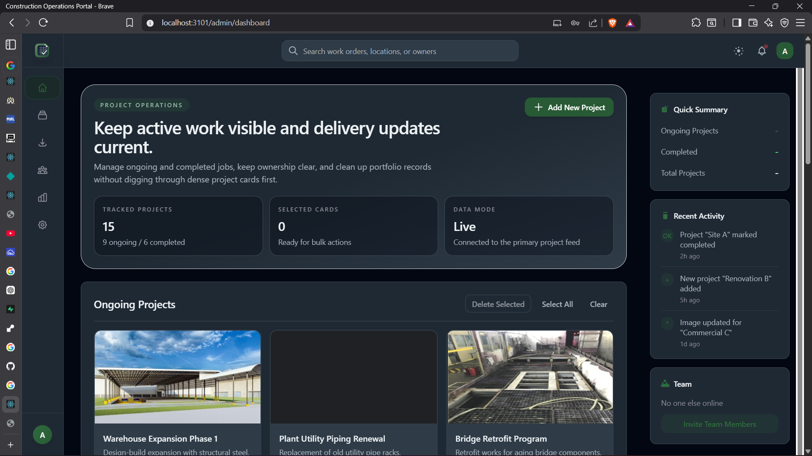
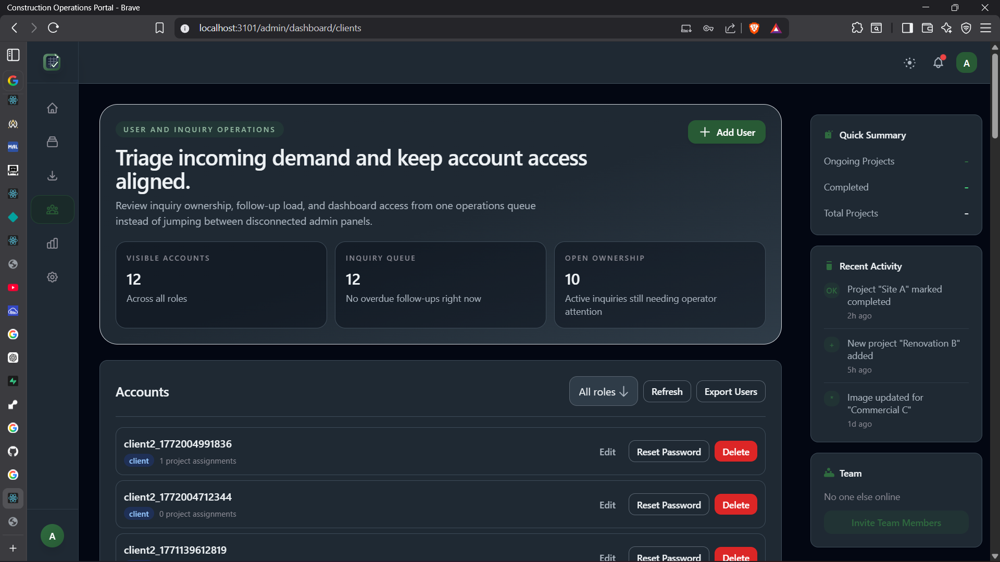
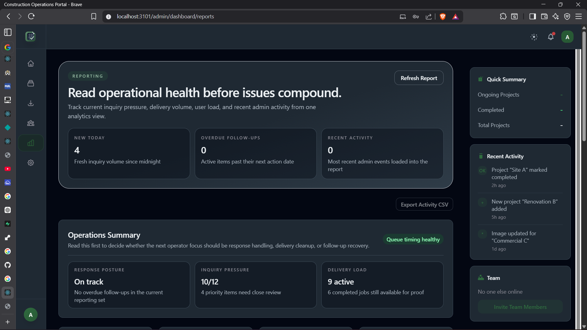

# Construction Operations Portal

Construction business marketing and operations software in one connected platform.

A full-stack hybrid construction operations platform: public contractor marketing, client-facing portal positioning, and role-based internal dashboards for project visibility, files, and inquiry operations.


## Why It Lands

- shows both the public-facing brand experience and the internal system behind delivery
- feels more credible than a brochure site because it includes actual client and admin workflows
- communicates a clear business story for contractors, clients, and internal teams
- works well as both a product concept and a portfolio-ready full-stack showcase

## At A Glance

- combines public-facing construction marketing with authenticated operational tooling
- supports client visibility, inquiry handling, file workflows, and role-based dashboards
- framed as a hybrid product that sells both service credibility and delivery capability
- stronger than a brochure site because it proves the system behind the promise

## Why This Project Stands Out

This project is attractive because it does two jobs well at the same time: it markets a construction business publicly and proves the internal operating system behind that promise with authenticated dashboards, file workflows, and inquiry handling.

That gives the repo stronger portfolio value than a brochure site or a generic admin panel because it shows product positioning, user segmentation, operations thinking, and full-stack delivery in one place.

## The Pitch

Construction Operations Portal helps a construction business look credible externally and operate more effectively internally.

Public visitors get:

- clearer positioning
- project proof and service confidence
- a more polished inquiry experience

Internal teams and clients get:

- role-based dashboards
- shared file visibility
- cleaner inquiry ownership
- better operational structure around ongoing projects

## Demo

- Live app: `https://mastertech4.netlify.app/`
- API status endpoint: `https://mastertech-app-32jm.onrender.com/api/status`
- Demo video: coming soon

## Built For

- construction businesses that need a stronger digital front door
- teams that want cleaner client handoffs and file visibility
- internal staff managing projects, accounts, inquiries, and reporting
- recruiters, collaborators, and clients evaluating real product depth

## Demo Flow

1. A public visitor lands on the marketing site and explores services, proof, and sector positioning.
2. A prospect submits an inquiry through the contact workflow.
3. Internal users manage projects, files, reports, and accounts through role-based dashboards.
4. Clients access a workspace with shared visibility into relevant materials.
5. The product connects marketing, delivery, and ongoing communication in one system.

That full journey is what makes the repo feel like a business platform instead of disconnected pages.

## Quality Signals

- frontend build verified locally
- frontend test suite passing
- backend test suite passing
- root and backend dependency audits refreshed to resolve current local npm audit findings

## Screenshots

The screenshots below show the full hybrid story: public marketing, client visibility, and operational dashboards in one product.

- `docs/screenshots/home-light-hero.png` - Public homepage hero (light mode)
- `docs/screenshots/home-dark-hero.png` - Public homepage hero (dark mode)
- `docs/screenshots/projects-case-studies.png` - Projects route with case-study proof framing
- `docs/screenshots/residential-landing.png` - Residential segment landing page
- `docs/screenshots/about-hybrid-positioning.png` - About page hybrid positioning section
- `docs/screenshots/client-portal.png` - Public client-portal positioning page
- `docs/screenshots/client-workspace.png` - Authenticated client workspace summary
- `docs/screenshots/admin-projects-dashboard.png` - Admin projects dashboard
- `docs/screenshots/admin-accounts-queue.png` - Admin accounts and inquiry queue
- `docs/screenshots/admin-reporting-overview.png` - Admin reporting overview

### Public Experience








### Client Experience



### Admin Experience





## Highlights

- Public hybrid positioning: contractor marketing plus a dedicated client-portal value story
- Public client pages: home, about, services, projects, client portal, safety, contact
- Admin dashboard: projects, contacts/inquiries, analytics, account management, settings
- User workspace: files and account settings with a simplified dashboard shell
- Client workspace: summary view plus shared file library for current handoff visibility
- Role-based auth: admin, employee (`user`), client
- Project lifecycle: ongoing/completed, CRUD, media support
- File management workspace with visibility controls and activity tracking
- Contact workflow: reCAPTCHA-protected submissions, inquiry status/priority/assignment updates
- Responsive UI with mobile navigation/sidebar improvements

## Product Positioning

This repo is positioned as a hybrid construction operations product.

- The public site sells the service business: sectors served, project proof, safety posture, and contact intake.
- The client portal side sells the operating experience: shared files, current workspace visibility, and cleaner handoffs.
- The admin and user dashboards prove the internal system behind that promise: role-aware routing, inquiry ownership, reporting, and release verification.

That framing is stronger than treating the app as a pure brochure site or pretending it is a generic SaaS product with no delivery context.

## Business Value

- improves credibility for construction businesses with a stronger digital front door
- reduces friction between public marketing and internal delivery workflows
- gives clients better visibility into files and project handoff materials
- supports cleaner inquiry management and operational coordination
- creates a more differentiated product story than a standalone website or isolated dashboard

## Portfolio Value

Construction Operations Portal is a strong portfolio piece because it shows:

- hybrid product thinking across marketing and operations
- full-stack delivery with multiple user segments
- real business positioning, not just technical implementation
- a polished, credible story for clients, recruiters, and collaborators

## Contributors

This project is developed with support from `Claude` and `Codex` for implementation, iteration, debugging, and QA workflows.

## Tech Stack

- Frontend: React 18, React Router 6, Vite, Vitest, Tailwind CSS, AOS, Font Awesome
- Backend: Node.js, Express, Mongoose, Express Session, CORS, Multer, Nodemailer
- Storage/Services: MongoDB Atlas (or local fallback JSON), optional Cloudinary + CloudConvert
- Deployment targets: Netlify (frontend), Render (backend)

## Architecture

- `src/`: client app (public pages + role dashboards)
- `backend/server.js`: Express API and auth/session logic
- `backend/models/`: Mongo models (`User`, `Project`, `FileItem`, `Inquiry`, `ActivityLog`)
- `backend/scripts/`: utility and smoke scripts
- `render.yaml` / `netlify.toml`: deployment configs

## Main Routes

- Public:
  - `/`
  - `/about`
  - `/services`
  - `/projects`
  - `/client-portal`
  - `/safety`
  - `/contact`
  - `/solutions/industrial`
  - `/solutions/commercial`
  - `/solutions/renovation`
  - `/solutions/residential`
- Auth:
  - `/signin`
  - `/signup`
  - `/staff/signin`
  - `/setup/admin`
  - `/forgot-password`
  - `/reset-password`
- Admin:
  - `/admin/dashboard/projects`
  - `/admin/dashboard/files`
  - `/admin/dashboard/clients`
  - `/admin/dashboard/reports`
  - `/admin/dashboard/settings`
- User:
  - `/user/dashboard`
- Client:
  - `/client/workspace`
  - `/client/files`

## API Surface (selected)

- Health: `GET /api/status`
- Auth: `POST /api/login`, `POST /api/register`, `POST /api/logout`, `GET /api/me`
- Password recovery: `POST /api/auth/forgot-password`, `POST /api/auth/reset-password`
- Projects: `GET/POST/PUT/DELETE /api/projects`
- Admin users:
  - `GET /api/admin/users`
  - `POST /api/admin/users`
  - `PUT /api/admin/users/:id`
  - `POST /api/admin/users/:id/reset-password`
  - `DELETE /api/admin/users/:id`
  - `GET /api/admin/export/users` (CSV download of user list; optional query param `role`)
  - `GET /api/admin/export/inquiries` (CSV download of inquiries; optional `status` filter)
  - `GET /api/admin/export/activity` (CSV download of activity logs; optional `limit`)

- Scheduled exports: when the backend is running it writes daily CSV files to an `exports/` directory adjacent to the project root. The files include `users.csv`, `inquiries.csv`, and `activity_logs.csv`, and are regenerated every 24 hours (first run about 30 seconds after start).
- Inquiries:
  - `POST /api/contact` (public submission)
  - `GET /api/admin/inquiries`
  - `PUT /api/admin/inquiries/:id`
  - `DELETE /api/admin/inquiries/:id`

## Local Development

### 1) Install dependencies

```bash
npm install
cd backend && npm install
cd ..
```

### 2) Configure environment

Create `.env` in repo root (or copy from deployment templates):

Required/important keys:

- `MONGO_URI`
- `FRONTEND_URL`
- `SESSION_SECRET`
- `CORS_ORIGINS`
- `FIRST_ADMIN_SETUP_TOKEN` (required in production before creating the first admin account)
- `ADMIN_USER`, `ADMIN_PASS`
- `EMP_USER`, `EMP_PASS`
- `CLIENT_USER`, `CLIENT_PASS`
- `RECAPTCHA_SECRET_KEY` (for strict contact validation)
- `EMAIL_USER`, `EMAIL_PASS`, `CONTACT_EMAIL` (for email notifications)
- Optional cloud/file features:
  - `CLOUDINARY_CLOUD_NAME`, `CLOUDINARY_API_KEY`, `CLOUDINARY_API_SECRET`
  - `CLOUDCONVERT_API_KEY`

Frontend optional key:

- `REACT_APP_RECAPTCHA_SITE_KEY`

Password reset guardrails:

- `FRONTEND_URL` must be set to the public frontend origin used in reset links, for example `https://your-app.netlify.app`.
- `EMAIL_USER` and `EMAIL_PASS` are required in production because forgot-password now sends real reset emails.
- In local development, leaving `EMAIL_USER` and `EMAIL_PASS` blank is supported. The forgot-password screen still shows the generic success response, and the backend logs the reset link to the console for testing.
- Production startup now fails fast if `FRONTEND_URL`, `EMAIL_USER`, or `EMAIL_PASS` are missing.

First admin bootstrap:

- Production no longer auto-seeds demo admin accounts.
- Set `FIRST_ADMIN_SETUP_TOKEN` in the backend environment before first release.
- If `GET /api/auth/setup-status` reports `requiresAdminSetup: true`, open `/setup/admin` and create the first admin account with that token.
- After the first admin exists, `/setup/admin` is no longer available as a normal setup path.
- After the first admin is created, remove or rotate `FIRST_ADMIN_SETUP_TOKEN` in the backend environment. Leaving it configured after setup is complete keeps unnecessary bootstrap access available.

reCAPTCHA deployment guardrails:

- `RECAPTCHA_SECRET_KEY` and `REACT_APP_RECAPTCHA_SITE_KEY` must come from the same Google reCAPTCHA project.
- The site key must allow every deployed frontend hostname that should render the live widget.
- For Render + Netlify, that usually means the production frontend domain, any preview domain you intend to use for real contact testing, and any custom domain.
- Localhost no longer needs to be added for standard development because the contact page uses a local verification path on `localhost`.
- If the deployed contact page shows a Google domain error inside the widget, verify the allowed domains in Google first, then confirm the frontend site key and backend secret still match.

Deployment env templates:

- `render.env.template`
- `netlify.env.template`

### 3) Run app

Run frontend + backend together:

```bash
npm run dev
```

This starts:

- backend on `http://localhost:3002`
- frontend on `http://localhost:3001`

Alternate local demo ports used in this repo are also supported:

- frontend on `http://localhost:3101`
- backend on `http://localhost:3102`

The local dev proxy now follows the supported port pair:

- frontend `3001` proxies `/api/*` to backend `3002`
- frontend `3101` proxies `/api/*` to backend `3102`

To start the backend explicitly on the demo port without editing env files:

```bash
npm run start:backend:demo
```

This command also forces `NODE_ENV=development` and blanks the email env vars, which keeps the local demo contact flow usable by skipping live reCAPTCHA verification and returning the no-email success path locally.

The same no-email local behavior applies to forgot-password. The UI stays generic, and the backend console logs the reset URL so you can test the reset flow without SMTP credentials.

On localhost, the contact page now swaps the live Google reCAPTCHA widget for a local verification control in development mode. Production and deployed preview environments still use the real widget and require a valid site key.

You can also run frontend only:

```bash
npm start
```

`npm start` now runs the Vite dev server. If you run the frontend without the backend, public pages still render, but project data and admin API features will show fallback messaging until the API is available.

## Build and Verify

Frontend build and test now run through Vite and Vitest.

```bash
npm run build
```

The frontend build now runs directly through Vite; it does not require `cross-env` for production builds.

Other useful scripts:

- `npm run verify:release` (build + frontend tests + backend tests)
- `npm run smoke:public-ui` (focused public-route smoke coverage for theme toggle, mobile nav, shared layout, and localhost contact verification)
- `npm run verify:public-ui` (build + focused public-route smoke coverage)
- `npm run verify:release:public` (public build, public-route smoke coverage, bundle budget, and tracked public-asset budget)
- `npm run verify:ci` (runs the same public release and security audit checks used by the GitHub Actions CI workflow)
- `npm run verify:production` (runs the deployed production smoke, deployed contact probe, and production health report in one pass)
- `npm run check:deploy-config` (fails if deployment templates/docs drift away from the supported Netlify + Render and Render-static env expectations)
- `npm run check:bundle-budget` (fails if the built JS output exceeds the local demo budget)
- `npm run check:public-assets` (fails if the tracked public marketing assets exceed the local demo budget)
- `npm run check:security-audit` (runs frontend and backend `npm audit --json` checks and fails if either side still has vulnerabilities)
- `npm run report:production-health` (prints a live deployed health snapshot with status codes and timings for key public and API routes)
- `npm run report:unused-uploads` (lists oversized public upload files that are not referenced by the current frontend source)
- `npm run smoke:local-demo` (checks local frontend + backend demo routes on `3001/3002` or `3101/3102`)
- `npm run smoke:production` (checks a deployed frontend across core public routes plus `/api/status`, `/api/auth/me`, and a production-safe invalid-token contact probe)
- `npm run smoke:deploy-runtime` (checks a frontend origin and its API boundary via `/`, `/api/status`, and anonymous `/api/auth/me`)
- `npm run smoke:deploy-contact` (checks a deployed contact route and sends a production-safe invalid reCAPTCHA probe to `/api/contact`)
- `npm run smoke:admin-authenticated` (checks local or deployed admin shell routes plus authenticated admin APIs through the frontend origin)
- `npm run smoke:admin` (logs in as admin and checks the dashboard API shape locally)
- `npm run smoke:contact` (submits a local demo inquiry to the public contact endpoint)
- `npm run verify:demo` (builds, checks the bundle budget, boots an isolated demo backend, and runs the full local demo smoke set)
- `npm run smoke:rbac` (basic RBAC smoke checks)
- `npm run optimize` (build + bundle analysis)

### Release Gate

Short operator path:

1. Run `npm run verify:release:public`
2. Deploy
3. Run `FRONTEND_URL=... BACKEND_URL=... npm run verify:production`
4. Record the result in [`docs/POST_DEPLOY_EVIDENCE_TEMPLATE.md`](./docs/POST_DEPLOY_EVIDENCE_TEMPLATE.md)
5. Classify the outcome with [`docs/PRODUCTION_ALERT_THRESHOLDS.md`](./docs/PRODUCTION_ALERT_THRESHOLDS.md)

The compressed operator version is documented in [`docs/RELEASE_OPERATOR_CHECKLIST.md`](./docs/RELEASE_OPERATOR_CHECKLIST.md).
For a local reproduction of the current GitHub Actions gate, run `npm run verify:ci`.

Run this sequence before shipping demo or production changes:

```bash
npm run verify:release
```

For public-site-only releases, use the dedicated public release path:

```bash
npm run verify:release:public
```

If the backend is running locally, also run:

```bash
npm run smoke:public-ui
npm run smoke:local-demo
npm run smoke:admin-authenticated
npm run smoke:admin
npm run smoke:contact
npm run smoke:rbac
```

For a deployed preview or production frontend, you can also run:

```bash
FRONTEND_URL=https://your-preview-or-production-site npm run smoke:deploy-runtime
```

If you want the script to validate the backend base URL directly as well:

```bash
FRONTEND_URL=https://your-preview-or-production-site BACKEND_URL=https://your-backend-host npm run smoke:deploy-runtime
```

For a deployed contact-flow check that does not create a real inquiry, run:

```bash
FRONTEND_URL=https://your-preview-or-production-site npm run smoke:deploy-contact
```

For an authenticated admin smoke pass through the frontend origin, run:

```bash
FRONTEND_URL=https://your-preview-or-production-site npm run smoke:admin-authenticated
```

On localhost, the same command can auto-detect `3101` or `3001` and will create a temporary admin account only if the default admin login is rejected. On any non-local frontend URL, it will not create an account and instead requires valid `ADMIN_USER` and `ADMIN_PASS` credentials in the environment.

For one production-safe deploy smoke command that covers the core public routes and contact path together, run:

```bash
FRONTEND_URL=https://your-preview-or-production-site BACKEND_URL=https://your-backend-host npm run smoke:production
```

For a non-destructive deployed health snapshot with timings, run:

```bash
FRONTEND_URL=https://your-preview-or-production-site BACKEND_URL=https://your-backend-host npm run report:production-health
```

For one operator-facing production verification pass, run:

```bash
FRONTEND_URL=https://your-preview-or-production-site BACKEND_URL=https://your-backend-host npm run verify:production
```

Before releasing a deployed contact-flow change, also confirm:

- the backend service has `RECAPTCHA_SECRET_KEY`
- the frontend build has `REACT_APP_RECAPTCHA_SITE_KEY`
- both values come from the same Google reCAPTCHA project
- the Google site key allowlist includes the deployed frontend hostname you are shipping

`smoke:deploy-contact` validates the deployed `/contact` route and then posts a fictional inquiry with an intentionally invalid reCAPTCHA token. The expected result is a `400` JSON response with the reCAPTCHA failure payload, which proves the deployed contact path is wired up without generating a real inquiry.

`smoke:production` combines the deployed public-route shell check with the same-origin API boundary checks and the invalid-token contact probe. It verifies `/`, `/services`, `/projects`, `/contact`, `/api/status`, `/api/auth/me`, and `/api/contact` from the deployed frontend origin, and optionally checks the backend base `/api/status` directly when `BACKEND_URL` is provided.

`smoke:admin-authenticated` extends the deployed or local smoke coverage into the admin side. It verifies `/login/admin`, `/admin/dashboard/projects`, and `/admin/dashboard/reports` through the frontend origin, logs in as admin, confirms `/api/auth/me`, `/api/projects`, `/api/admin/kpis`, and `/api/admin/inquiries?limit=3`, then verifies logout returns the session to `401 Unauthorized`.

`report:production-health` is the lighter companion to `smoke:production`: it records status codes and timings for the deployed frontend shell, key public routes, and API boundary. Set `REPORT_JSON=1` if you want the command to also print a JSON payload that can be attached to release notes or incident notes.

`verify:production` runs `smoke:production`, `smoke:deploy-contact`, and `report:production-health` in sequence, so deployed verification can be repeated with one command during release sign-off.

Detailed public release sign-off is documented in [`docs/PUBLIC_RELEASE_CHECKLIST.md`](./docs/PUBLIC_RELEASE_CHECKLIST.md).
Deployed preview sign-off is documented in [`docs/DEPLOY_PREVIEW_VALIDATION.md`](./docs/DEPLOY_PREVIEW_VALIDATION.md).
Use [`docs/RELEASE_OPERATOR_CHECKLIST.md`](./docs/RELEASE_OPERATOR_CHECKLIST.md) for the fastest operator path during deploys.
Use [`docs/POST_DEPLOY_EVIDENCE_TEMPLATE.md`](./docs/POST_DEPLOY_EVIDENCE_TEMPLATE.md) to capture the actual evidence after a preview or production deploy.
Use [`docs/PRODUCTION_HEALTH_REPORT_EXAMPLE.md`](./docs/PRODUCTION_HEALTH_REPORT_EXAMPLE.md) if you need a concrete `REPORT_JSON=1` example for release notes or incident notes.
Use [`docs/PRODUCTION_ALERT_THRESHOLDS.md`](./docs/PRODUCTION_ALERT_THRESHOLDS.md) to decide whether the current smoke/report results should block release or just create follow-up work.
Use [`docs/VULNERABILITY_REMEDIATION_PLAN.md`](./docs/VULNERABILITY_REMEDIATION_PLAN.md) to reconcile the current clean local audits with any stale GitHub security banner counts.
The GitHub Actions CI workflow now runs `npm run verify:release:public` and `npm run check:security-audit` on pushes and pull requests to `main`.

`smoke:local-demo` checks:

- backend `GET /api/status`
- frontend `/`
- frontend `/contact`
- frontend `/login/admin`

It auto-detects the supported local demo ports by app signature and currently prefers the repo's alternate pair (`3101/3102`) before falling back to `3001/3002`. You can override detection with `FRONTEND_URL` and `BACKEND_URL`.

`smoke:admin` logs into the backend using the configured admin credentials and checks:

- authenticated `GET /api/auth/me`
- authenticated `GET /api/admin/kpis`
- authenticated `GET /api/admin/inquiries?limit=5`

`smoke:contact` submits a fictional inquiry payload to `/api/contact` and expects the local demo backend to return a success message.

For a single local demo verification command, run:

```bash
npm run verify:demo
```

The demo verification command now includes a lightweight bundle budget check before the smoke tests:

- main JS bundle must stay at or under `190 kB`
- total built JS output must stay at or under `700 kB`

It also includes a tracked public-asset budget for the files used by the public site:

- no single tracked marketing asset may exceed `1.5 MB`
- tracked public assets total must stay at or under `3.25 MB`

The public release path also checks deployment template/doc consistency for the supported deploy targets:

- Netlify frontend uses `BACKEND_API_URL` plus `REACT_APP_RECAPTCHA_SITE_KEY`
- Render backend uses `RECAPTCHA_SECRET_KEY`, `CORS_ORIGINS`, and the normal server secrets
- Render static frontend uses `REACT_APP_API_URL` plus `REACT_APP_RECAPTCHA_SITE_KEY`

For cleanup work, you can also run:

```bash
npm run report:unused-uploads
```

That report flags large files in `public/Uploads` that are not referenced by the current frontend source, so dead demo assets can be reviewed before they bloat the repo further.

`verify:demo` now starts its own temporary backend on port `3202`, so it does not depend on whichever local backend process is already running. It still expects the frontend demo app to be available on `http://localhost:3101` unless you override `FRONTEND_URL`.

If the default admin login is rejected locally, the smoke script falls back to creating a temporary admin user through the existing admin signup-code flow.
If the local backend process returns non-JSON content for `/api/admin/kpis`, the script logs a warning and still completes the auth + inquiry smoke path.

Manual smoke checklist:

- Admin login succeeds and lands on dashboard
- Public contact form submits successfully
- Inquiry update requires owner and next follow-up date
- Overdue follow-up queue renders and quick actions work
- Mobile nav and dark mode remain readable on public pages

## Deployment

- Frontend: Netlify
- Backend: Render web service
- Use:
  - `render.yaml`
  - `netlify.toml`
  - `DEPLOY_NETLIFY.md`

Set `BACKEND_API_URL` in Netlify to your Render backend URL.
For deployed preview checks, use [`docs/DEPLOY_PREVIEW_VALIDATION.md`](./docs/DEPLOY_PREVIEW_VALIDATION.md).
The Netlify and Render static-frontend builds install devDependencies during the build step because the Vite toolchain lives in the frontend build dependency set.

## Security Notes

- Do not commit real credentials or API keys.
- Rotate any exposed secrets immediately.
- Use strong `SESSION_SECRET` and production cookie settings.
- Configure strict `CORS_ORIGINS` for your deployed frontend domains only.
- Production startup now fails fast if `MONGO_URI`, `SESSION_SECRET`, or `CORS_ORIGINS` are missing.
- Production auth no longer falls back to demo passwords like `1111`; set explicit credential env vars if you still need demo accounts.

## Supporting Docs

- `FILE_MANAGEMENT_GUIDE.md`
- `DARK_MODE_DOCUMENTATION_INDEX.md`
- `UI_IMPROVEMENTS_SUMMARY.md`
- `RELEASE_NOTES_v0.1.0-ui-stabilization.md`
- `SECURITY.md`
- `CONTRIBUTING.md`

## Suggested Portfolio Positioning

For portfolio presentation, frame this as:

- A hybrid construction operations product, not just a brochure site
- Contractor marketing paired with a client-portal value proposition
- A client workspace that turns the portal promise into a usable in-app summary, not just a file dump
- Practical RBAC + operations dashboard implementation
- Full workflow from lead capture to operational handling
- Emphasis on responsive UX, reliability fallback, and deployment-ready setup

## Portfolio Case Studies

Use these sample narratives when presenting the app to future clients:

### 1. Industrial Retrofit Coordination

- Problem: field teams were tracking handoffs and blockers in scattered chats and spreadsheets
- Solution: centralized inquiry ownership, project visibility, and admin follow-up controls
- Impact: faster weekly reporting, fewer missed handoffs, clearer overdue action tracking

### 2. Commercial Contractor Lead Handling

- Problem: inbound opportunities were captured but not consistently qualified or reassigned
- Solution: public contact funnel connected to admin inquiry workflow with owner, priority, and next follow-up date
- Impact: visible qualification pipeline, fewer stale leads, stronger accountability on response timing

### 3. Portfolio-Ready Operations Demo

- Problem: many showcase apps stop at visuals and do not demonstrate operating discipline
- Solution: responsive public pages, role-aware dashboards, inquiry lifecycle controls, KPI cards, and release verification
- Impact: stronger client confidence that the product thinking covers both marketing and internal operations

## Engineering Challenges Solved

- Built role-scoped workspaces with route protection and server-side authorization checks.
- Stabilized client and dashboard navigation across desktop/mobile, including hamburger/sidebar behavior.
- Implemented inquiry lifecycle operations (search, paging, update, delete safety checks, reporting rollups).
- Added resilient data strategy with fallback JSON mode and MongoDB mode for demos and unreliable environments.
- Improved visual consistency with full client dark mode tokenization and page-level overrides.

## Release Checklist

- [x] Live frontend deployed and linked
- [x] Live backend deployed and linked
- [ ] Demo video uploaded
- [x] Screenshot set added to `docs/screenshots`
- [ ] Demo credentials verified
- [ ] Final smoke test on production URLs


